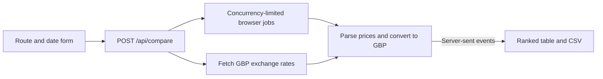

# Geo Fare Gap

A Next.js application for comparing flight fares returned from different browsing countries. It sends the same route and date to browser agents, converts readable prices to GBP, and streams rows into a ranked table with CSV export.

The TypeScript API creates one TinyFish job per selected site/country pair and limits concurrent jobs. React receives progress over server-sent events and displays live browser previews. Price parsing and currency conversion are separate from the agent orchestration.



## Run locally

Node.js 20+ and npm. From this folder:

```sh
npm ci
cp .env.example .env.local
npm run dev
```

Set `TINYFISH_API_KEY` in `.env.local`, then open `http://localhost:3000`. `TINYFISH_CONCURRENCY` defaults to 2 and accepts 1–10. Each selected pair starts an agent job; start with a small selection.

```sh
npm test
npm run lint
```

Nine site URL builders and seven countries are configured. Successful coverage of all combinations has not been verified. Agents may return different itineraries, so the table cannot establish a price difference for the same seat or prove its cause. There is no booking or itinerary-matching step.

[Architecture, validation limits and recorded screenshots](docs/implementation.md)
