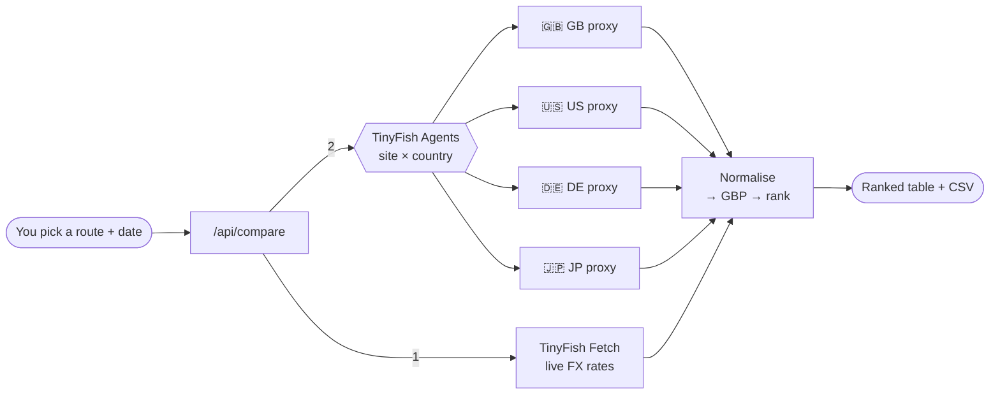
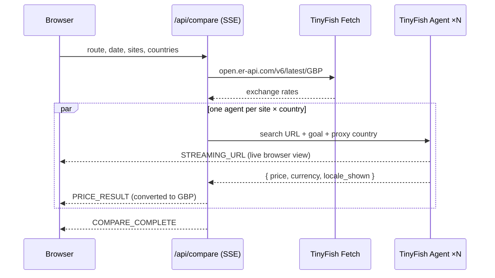

# ✈️ Geo Fare Gap

**Same seat. Different country, different price.**

Geo Fare Gap searches one flight on up to **9 flight sites** from up to **7 countries** at the same time, then ranks every fare in GBP so you can see where the same seat is cheapest.

<div align="center">


</div>

---

## What it does

Flight sites often show a different price depending on where you browse from. Checking that by hand means a VPN, a lot of tabs and a currency converter. Geo Fare Gap does it in one click:

1. **Pick** an origin, a destination and a date on the calendar.
2. **Choose** which flight sites and countries to check.
3. **Watch** TinyFish browser agents search live, one per site × country.
4. **Get** a ranked table in GBP showing the cheapest option and how much more every other option costs. You can export it as a CSV.

## How TinyFish is used

| Endpoint | Job in this app |
|---|---|
| **Agent** | One browser agent per *site × country*. Each one goes through that country's proxy (`proxy_config.country_code`) with a stealth profile, so the site sees a local visitor. It reads the cheapest fare and returns it as JSON. |
| **Fetch** | Pulls live GBP exchange rates at search time, so every price can be compared in the same currency. |



## Demo

> Agents running on the live web, seen in the TinyFish dashboard

| Agent on Google Flights | Agent solving a captcha |
|---|---|
|  |  |

## What happens when you press Compare



Results stream back as each agent finishes, so the table fills in live. You can also watch every agent browse in its own live preview window.

## Coverage

| Flight sites (9) | Countries (7) |
|---|---|
| Google Flights · Kayak · Skyscanner<br/>Momondo · Cheapflights · Expedia<br/>Kiwi.com · Trip.com · Booking.com | 🇬🇧 UK · 🇺🇸 US · 🇩🇪 Germany · 🇫🇷 France<br/>🇨🇦 Canada · 🇯🇵 Japan · 🇦🇺 Australia |

## The core call

```ts
const stream = await client.agent.stream({
  url: site.buildUrl(origin, destination, date),       // e.g. Google Flights search URL
  goal: buildGoal(origin, destination, date),          // "cheapest fare, don't change region/currency, return JSON"
  browser_profile: BrowserProfile.STEALTH,
  proxy_config: { enabled: true, country_code: market }, // "GB" | "US" | "DE" | ...
});
```

Each agent returns:

```json
{
  "site_name": "Google Flights",
  "product_description": "LHR-JFK 12 Nov, economy, nonstop",
  "price": 412,
  "currency": "USD",
  "price_text": "$412",
  "locale_shown": "US / English / USD",
  "notes": "Price per adult incl. taxes"
}
```

## Run it yourself

```bash
git clone https://github.com/Yuv4n/price-mismatch-flights.git
cd price-mismatch-flights
npm install
cp .env.example .env.local   # add your TINYFISH_API_KEY
npm run dev                  # → http://localhost:3000
```

Get an API key at [agent.tinyfish.ai/api-keys](https://agent.tinyfish.ai/api-keys).

| Variable | Required | Purpose |
|---|---|---|
| `TINYFISH_API_KEY` | ✅ | Server-side TinyFish key |
| `TINYFISH_CONCURRENCY` | — | How many agents run at once (default `2`; match your plan) |

> 💡 **Tip:** start with one site and 2–3 countries. Every site × country pair is its own browser agent, so the full set of 9 × 7 means 63 agents.

```bash
npm test   # price parsing, currency detection, GBP conversion, ranking
```

## Project structure

```
src/
├── app/
│   ├── page.tsx                 # UI
│   └── api/compare/route.ts     # Fetch FX → one Agent per site × country (SSE)
├── components/
│   ├── compare-form.tsx         # Route, calendar, sites, countries
│   ├── date-calendar.tsx        # Month-grid date picker
│   ├── price-table.tsx          # Ranked GBP table + CSV export
│   └── live-preview-grid.tsx    # Live browser view per agent
├── hooks/use-price-compare.ts   # Streaming client
└── lib/
    ├── sites.ts                 # 9 flight sites + URL builders
    ├── markets.ts               # 7 proxy countries
    ├── fx.ts                    # GBP rates via TinyFish Fetch
    └── normalize.ts             # Parse, convert, rank
```

## Design choices

- **Live only:** no database and no cache. Every price comes from the web at search time.
- **Don't touch the region settings:** agents are told not to change the site's country or currency, so you see the default price for that location.
- **Validated results:** a `COMPLETED` run only means the browser didn't crash, so every result is checked before it reaches the table.

---

<div align="center">

Built with <a href="https://tinyfish.ai">TinyFish</a> · <a href="https://github.com/tinyfish-io/tinyfish-cookbook">TinyFish Cookbook</a>

</div>
