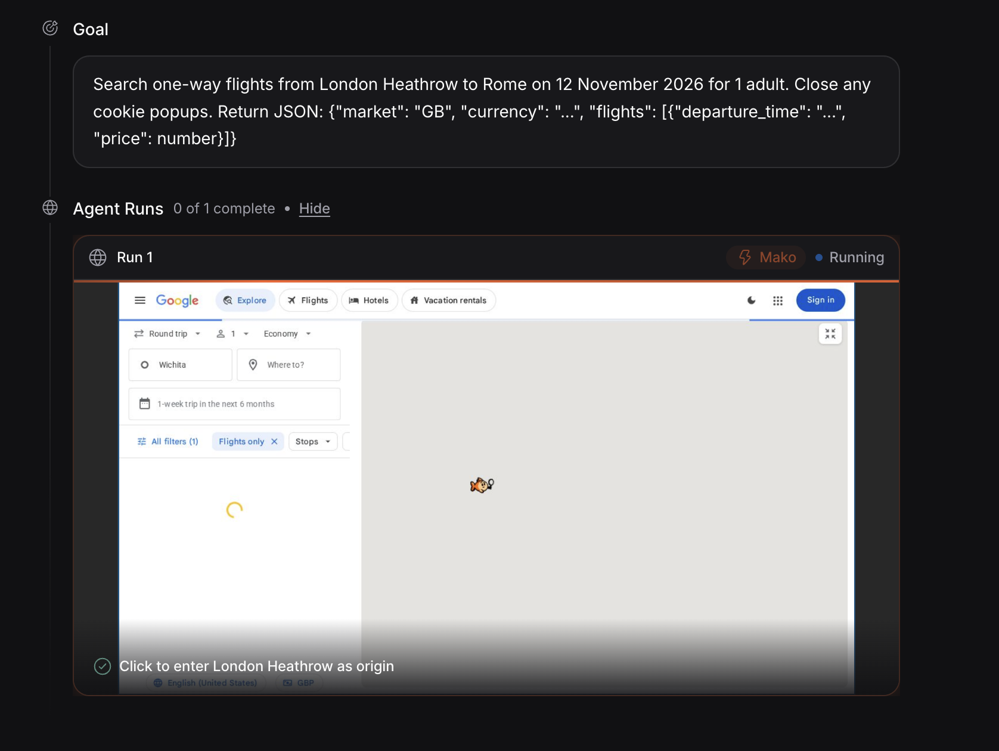
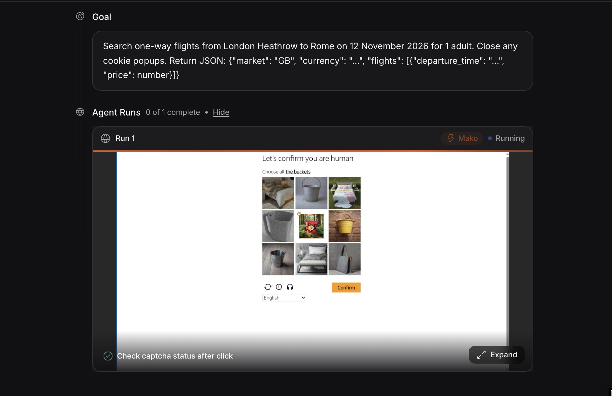

# Flight comparison implementation

`src/app/api/compare/route.ts` validates route input and streams job progress. A worker pool caps simultaneous TinyFish agents. `src/hooks/use-price-compare.ts` reads the stream; `price-table.tsx` ranks converted rows and exports CSV. There is no database or stored search history.

The configured sites are Google Flights, Kayak, Skyscanner, Momondo, Cheapflights, Expedia, Kiwi.com, Trip.com and Booking.com. Countries are GB, US, DE, FR, CA, JP and AU. These are configured targets, not verified coverage guarantees.

`src/lib/fx.ts` first requests GBP rates through TinyFish Fetch, then falls back to a direct request to the same exchange-rate source. If both fail, GBP rows can still be ranked while other currencies remain unconverted.

An agent is prompted to return the cheapest one-way economy fare for one adult without changing site region settings. The code parses prices and currency fields; it does not validate a shared flight number, departure time or baggage allowance. A completed agent can still return no usable fare. Differences may reflect itineraries, availability or extraction errors as well as country settings.

`src/__tests__/normalize.test.ts` covers parsing and ranking. All 11 existing tests passed during this review; lint and TypeScript checks also passed. The tests do not exercise live agents, streaming disconnects or every site/country pair. No authenticated live comparison was run in this review.

## Recorded screenshots

These existing images show prior browser-agent sessions. They do not prove current fare accuracy or reliable captcha handling.

